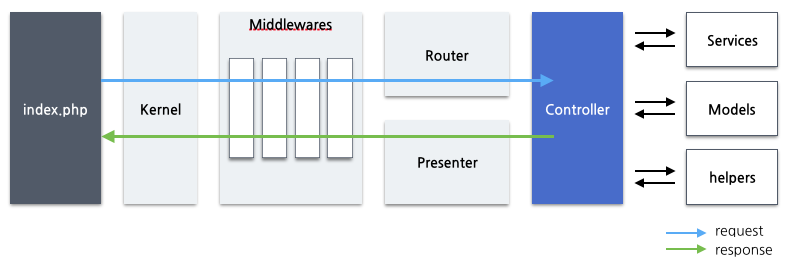

# 라이플 사이클

여러분이 XE를 사용하거나 XE의 플러그인을 개발하려고 한다면, XE 사용법, 플러그인 제작법, 그리고 XE에서 제공하는 여러가지 서비스의 사용법을 숙지하는 것 만으로도 충분히 많은 것을 할 수 있습니다. 하지만 여러분이 좀 더 고도의 기능을 필요로 하는 플러그인을 만들거나 XE를 제대로 사용하고 싶다면, XE가 어떤 방식과 구조로 요청을 처리하는지에 대한 전체적인 흐름을 알고 있어야 합니다. 전체적인 흐름을 알고 있지 않다면 결국 한계에 도달할 것이고, 전체적인 흐름을 알기 위해 노력하는 시점이 올 것입니다.

XE의 라이프 사이클은 크게 두 가지 경우로 나눌 수 있습니다. 사용자들의 웹브라우저로 부터 http 요청을 받았을 때, 이를 처리하고 응답하는 일반적인 경우와, 사이트 관리자가 ssh와 같은 콘솔에 접근하여 php 명령을 실행시킬 경우가 있습니다. 이 문서에서는 더 일반적으로 생각할 수 있는 http 요청을 처리하는 경우에 대하여 살펴보겠습니다.

아래 다이어그램은 XE의 요청 처리 흐름을 개략적으로 보여줍니다.

## index.php

사용자의 웹브라우저로부터 http 전송 요청이 들어올 경우, XE는 항상 `index.php`파일을 실행시킵니다. `index.php` 파일이 그리 많은 코드를 가지고 있는 것은 아닙니다.

가장 먼저 `index.php`는 composer를 통해 생성된 autoload 파일을 로드합니다. autoload 파일을 로드함으로써 XE는 php 파일을 include하지 않고 자동으로 로드할 수 있게됩니다.

그 다음으로 서비스 컨테이너를 생성합니다. 서비스 컨테이너는 생성되자마자 주요 서비스인 라우팅\(routing\) 서비스와 이벤트\(events\) 서비스를 등록합니다.

세번째로는 http 요청을 처리하기 위한 Http 커널을 생성합니다. 그리고 현재 http 요청에 대한 정보를 가지는 `Request` 인스턴스를 생성합니다.

마지막으로 `Request` 인스턴스를 커널에게 전달하여 http 요청의 본격적인 처리를 시작합니다.

## Http 커널

Http 커널의 주목적은 단순하게 `Request`를 처리하고, 브라우저로 돌려줄 응답\(Http Response\)를 만드는 것입니다.

Http 커널은 `Illuminate\Foundation\Http\Kernel`를 상속받고 있으며, 생성된 다음에는 `Request`를 처리할 준비, 즉 부팅\(bootstrapping\)을 합니다.

Http 커널은 부팅 과정에서 에러 처리, 로그 설정, 어플리케이션의 실행 환경의 검사 등 실제로 요청이 처리되기 전에 수행해야 되는 작업들을 합니다.

또, Http 커널은 부팅 과정에서 데이터베이스, 문서, 회원과 같은 XE에서 제공하는 대부분의 [서비스](../xe/service.md)를 앞서 생성된 서비스 컨테이너에 등록합니다.

> **NOTE:** XE에서 활성화되어 있는 플러그인들이 부팅되는 시점은 서비스들이 등록된 바로 다음입니다.

## Http 미들웨어

Http 커널은 `Request` 처리할 준비가 완료되면, 커널에 등록된 미들웨어들에게 `Request`를 전달합니다. `Request`는 미들웨어들을 거친후 컨트롤러에게 전달됩니다.

Http 미들웨어는 글로벌 미들웨어\(global middleware\)와 라우트 미들웨어\(route middleware\)로 구분할 수 있습니다. 글로벌 미들웨어는 모든 요청에 대해 항상 작동하는 미들웨어이며, 라우트 미들웨어는 특정 라우트에 등록된 미들웨어입니다. `Request`에 해당하는 라우트가 선택되면 그 라우트에 등록된 미들웨어들이 작동합니다.

미들웨어에 대한 자세한 정보는 [라라벨 문서](http://xpressengine.github.io/laravel-korean-docs/docs/5.0/middleware/)를 참고하시기 바랍니다.

## 라우터

미들웨어를 통과한 `Request`는 라우터에게 전달됩니다. 라우터는 전달받은 `Request`를 전담하여 처리할 컨트롤러가 누군지 찾고, 찾은 컨트롤러를 호출합니다.

## 컨트롤러

각각의 `Request`는 모두 XE가 해주길 바라는 정확한 목적을 가지고 있습니다. 예를 들어, 어떤 요청은 게시판 글 출력이 목적일 수도 있고, 또 어떤 요청은 현재 사용자를 로그아웃 처리해 달라는 게 목적일 수도 있습니다. 컨트롤러는 `Request`의 주목적을 처리하는 역할을 합니다. XE에는 매우 많은 컨트롤러가 이미 포함돼 있고, 플러그인을 통해서도 많이 추가될 수 있습니다.

컨트롤러는 `Request`를 처리하기 위해 여러가지 서비스나 모델 그리고 헬퍼함수들을 가져다 사용합니다.

## 프리젠터

컨트롤러가 `Request`를 처리하고 나면 `Response`를 생성하기 위해 프리젠터를 호출합니다. 이 때 만약 화면 출력이 필요하다면 화면 출력에 필요한 데이터와 출력할 때 사용할 스킨정보를 프리젠터에게 전달합니다.

프리젠터는 컨트롤러가 전달한 데이터와 스킨정보, 그리고 지정된 테마 정보등을 조합해서 완성된 html 문서를 조립합니다. 이렇게 완성된 html 문서는 `Response` 인스턴스가 되어 다시 미들웨어를 거친후 브라우저로 전송됩니다.

프리젠터는 html 타입의 `Response` 뿐만 아니라, ajax 요청에 대한 응답과 같이 json 방식의 `Response`도 처리합니다.

